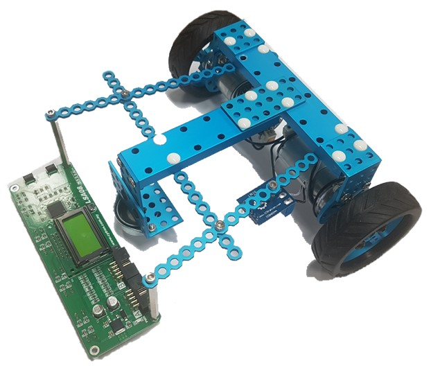
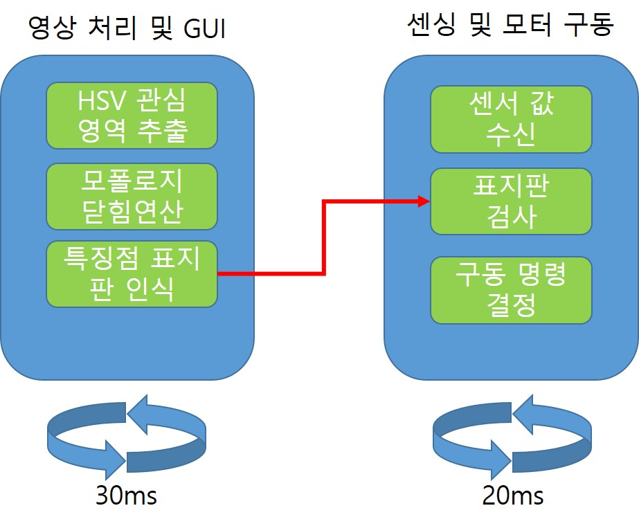

# 라인트레이서
## 작품 내용
### 개요
- #### 자동차의 자율주행을 도로 밑에 특정한 선이 있다고 가정하고 기술을 구현한 작품

### 구현
- #### 멀티 스레드로 다중 동시 작업 진행
- #### 라인 중앙을 진행하기 위한 속도 차등제어
- #### ORB특징점 추출 방식을 이용한 이미지 매칭
- #### 미리 설정한 이미지에 따른 상황 제어(천천히, 일시정지, 통행금지)

### 작품 사진

### 스레드 구성

### 작동영상
- #### https://youtu.be/zhyL2PNpiTY